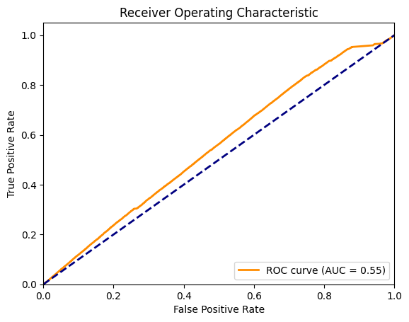

# CodeXGLUE -- Defect Detection

## Task Definition

Given a source code, the task is to identify whether it has a bug or not. We treat the task as binary classification (0/1), where 1 stands for insecure code and 0 for secure code.

### Dataset

The dataset we use comes from the paper [Defectors: A Large, Diverse Python Dataset for Defect Prediction](https://arxiv.org/abs/2303.04738). 

### Download and Preprocess

1.Download dataset from [here](https://doi.org/10.5281/zenodo.7708984) to "dataset" folder or run the following command:

```shell
cd dataset
wget https://zenodo.org/record/7708984/files/defectors.zip
unzip defectors.zip -d defectors
cd ..
```

2.Preprocess dataset

Dataset contains whole files with corresponding buggy lines. To predict if some code has a bug we need to divide it into functions and corresponding labels 0/1.

```shell
cd dataset
python preprocess.py
cd ..
```

### Data Format

After preprocessing dataset, you can obtain three .csv files, i.e. train.csv, valid.csv, test.csv

Csv has following data in each row.
	commit	repo	filepath

   - **func (string):** the source code
   - **target:** 0 or 1 (vulnerability or not)
   - **commit:** hash of the commit
   - **repo:** name of the project repository
   - **filepath:** path of a changed file in the commit

### Data Statistics

Data statistics of the dataset are shown in the below table:

|       | #Examples | % defective |
| ----- | :-------: | :---------: |
| Train |  508,089  |    36.18    |
| Val   |   25,043  |    10.27    |
| Test  |   23,051  |    10.18    |


## Pipeline-CodeBERT

We also provide a pipeline that fine-tunes [CodeBERT](https://arxiv.org/pdf/2002.08155.pdf) on this task.

### Fine-tune

```bash
cd code-ft
python run.py \
    --do_train \
    --model_type roberta \
    --tokenizer_name microsoft/codebert-base \
    --model_name_or_path microsoft/codebert-base \
    --train_filename preprocessed/random/train.csv \
    --dev_filename preprocessed/random/val.csv \
    --test_filename preprocessed/random/test.csv
    --epoch 5 \
    --block_size 400 \
    --train_batch_size 32 \
    --eval_batch_size 64 \
    --learning_rate 2e-5 \
    --max_grad_norm 1.0 \
    --evaluate_during_training \
    --output_dir model/python 
```

### Predict label based on CodeBERT summary of the code

Idea is simple. For a given code use CodeBERT to create the summary of the code, then look at the log-likelihood of created sequece. If model is confident in it's prediction we assume that it understands the code / code is cleaner or simpler ergo correlates with unbuggy code.

To establish desired threshold log-likelihoods for each prediction on whole train dataset was computed with 
[pre-trained CodeBERT](Code-Text/code-to-text/README.md) on python dataset. Results aren't spectacular, barely better than random, which can be illustrated by ROC. F1-score was used to pick threshold. Picking the treshold can be examined [here](Code-Code/code-to-text/code/notebooks/find_treshold.ipynb)




To run predictions on dataset

```shell
lang=python #programming language
batch_size=64
beam_size=10
source_length=256
target_length=128
output_dir=model/$lang
pretrained_model=microsoft/codebert-base #Roberta: roberta-base


python run.py \
    --do_train \
    --do_test \
    --model_type roberta \
    --model_name_or_path $pretrained_model \
    --output_dir $output_dir \
    --max_source_length $source_length \
    --max_target_length $target_length \
    --beam_size $beam_size \
    --train_batch_size $batch_size \
    --load_model_path ../../../Code-Text/code-to-text/code/model/python/checkpoint-best-bleu/pytorch_model.bin \
    --train_filename preprocessed/random/train.csv \
    --dev_filename preprocessed/random/val.csv \
    --test_filename preprocessed/random/test.csv

```


## Result

The results on the test set are shown as below:

| Methods  | Precision | Recall | F1 Score | Accuracy | 
| -------- | :-------: |  :-------: |  :-------: | -------: |
| [CodeBERT](https://arxiv.org/pdf/2002.08155.pdf) (zero-shot from log-likelihoods, threshold maximizing f1) | **0.107** | **0.956** | **0.193** | **0.180**
| [CodeBERT](https://arxiv.org/pdf/2002.08155.pdf) (zero-shot from log-likelihoods, threshold maximizing accuracy) | **0.115** | **0.478** | **0.186** | **0.570**
| [CodeBERT](https://arxiv.org/pdf/2002.08155.pdf) (finetune on dataset, threshold 0.5) | **0.230** | **0.637** | **0.337** | **0.7682** | 


## Reference
<pre><code>@inproceedings{zhou2019devign,
  title={Devign: Effective vulnerability identification by learning comprehensive program semantics via graph neural networks},
  author={Zhou, Yaqin and Liu, Shangqing and Siow, Jingkai and Du, Xiaoning and Liu, Yang},
  booktitle={Advances in Neural Information Processing Systems},
  pages={10197--10207},
  year={2019}
}</code></pre>
